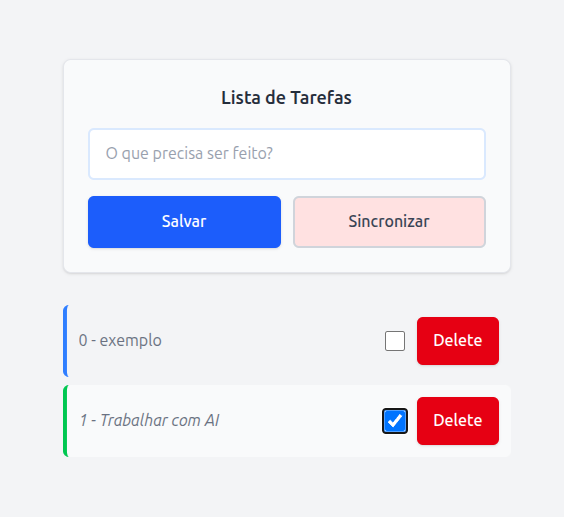

# todolist

A simple todo-list app built with [Dioxus](https://dioxuslabs.com) 0.7 (fullstack). Todos are persisted to a local SQLite database via `sqlx`.



## Project layout

```
src/
├─ main.rs            # App entry point, mounts the root component
├─ todo_component.rs   # UI: input form and todo list
└─ dao.rs              # Server functions: create/read/update/delete todos, SQLite access
assets/
└─ tailwind.css         # Compiled Tailwind output (auto-generated, don't hand-edit)
tailwind.css            # Tailwind source (@apply rules for custom classes)
```

## Running it

```bash
cargo install dioxus-cli
dx serve
```

The `server` feature (enabled by default) pulls in `sqlx`/`tokio` and powers the server functions in `dao.rs`. On first run, `create_table_if_exists` creates `todos.db` in the working directory automatically — no manual migration step needed.

To run on a different platform:

```bash
dx serve --platform desktop
```

## Tailwind

As of Dioxus 0.7, Tailwind is compiled automatically — just `dx serve`/`dx build` and it picks up the root `tailwind.css` and regenerates `assets/tailwind.css`. Custom classes (`btn-action-primary`, `item-list-done`, etc.) live in the root `tailwind.css` using `@apply`; edit that file, not the generated one in `assets/`.
